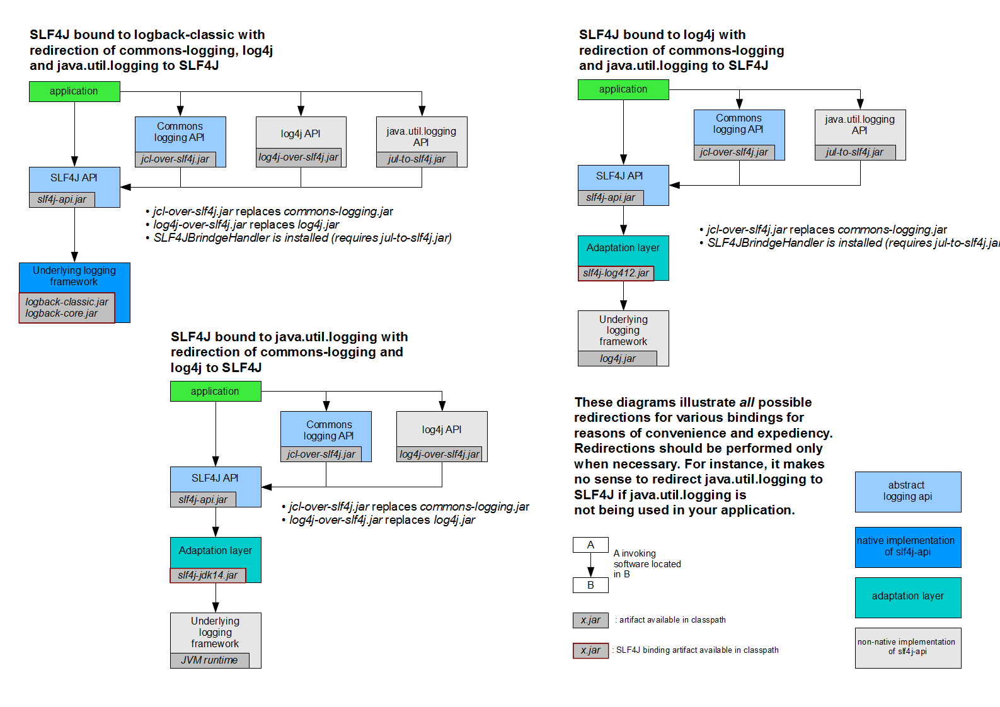

## 一、Spring Boot入门

### 1. pom文件

####	1. 父项目

~~~xml
<parent>
    <groupId>org.springframework.boot</groupId>
    <artifactId>spring-boot-starte-parent</artifactId>
    <version>1.5.9.RELEASE</version>
</parent>

他的父项目是
<parent>
  <groupId>org.springframework.boot</groupId>
  <artifactId>spring-boot-dependencies</artifactId>
  <version>1.5.9.RELEASE</version>
  <relativePath>../../spring-boot-dependencies</relativePath>
</parent>
他来真正管理Spring Boot应用里的所有依赖版本
~~~

Spring Boot 的版本仲裁中心：

以后导入依赖默认不需要写版本；（没有在dependencies里面管理的依赖是需要声明版本号的）


 ####  	2. 启动器

```xml
<dependencies>
      <dependency>
          <groupId>org.springframework.boot</groupId>
          <artifactId>spring-boot-starter-web</artifactId>
      </dependency>
</dependencies>
```

**spring-boot-starter**- ==**web**==

​		spring-boot-starter: spring-boot场景启动器; 帮我们导入 web 模块正常运行所依赖的组件

> Starters are a set of convenient dependency descriptors that you can include in your application. 
>
> Starters 是一组方便的依赖关系描述符，你可以将其包含在应用程序中。

Spring Boot将所有的功能都抽取出来，做成一个个的starters(启动器)，只需要在项目中引入这些starter，相关场景的所有依赖就都会导入进来。用什么功能就导入什么场景的启动器


### 2. 主程序类，主入口类

```java
/**
 * 用 @SpringBootApplication 来标注一个主程序类，说明这是一个Spring Boot应用
 */

@SpringBootApplication
public class HelloWorldMainApplication {

    public static void main(String[] args) {

        //Spring应用启动起来
        SpringApplication.run(HelloWorldMainApplication.class, args);
    }
}
```

@**SpringBootApplication**: Spring Boot 应用标注在某个类上说明这个类是 SpringBoot 的主配置类，

SpringBoot就应该运行该类的main方法来启动SpringBoot应用

```java
@Target({ElementType.TYPE})
@Retention(RetentionPolicy.RUNTIME)
@Documented
@Inherited
@SpringBootConfiguration
@EnableAutoConfiguration
@ComponentScan(
    excludeFilters = {@Filter(
    type = FilterType.CUSTOM,
    classes = {TypeExcludeFilter.class}
), @Filter(
    type = FilterType.CUSTOM,
    classes = {AutoConfigurationExcludeFilter.class}
)}
)
public @interface SpringBootApplication {
```

@**SpringBootConfiguration**： SpringBoot的配置类；

​		标注在哪个类上，那个类就是 Spring Boot 的配置类

​		@**Configration**：配置类上标注该注解

​				配置类  对应  spring 或 springMVC 的配置文件； 配置类也是容器中的一个组件  @Component

​	

@**EnableAutoConfiguration** ；开启自动配置功能

​		以前我们需要配置的东西，加了@**EnableAutoConfiguration** 这个注解，Spring Boot 就会自动帮我们配置。

```java
@AutoConfigurationPackage
@Import({EnableAutoConfigurationImportSelector.class})
public @interface EnableAutoConfiguration {
```

@**AutoConfigurationPackage**： 自动配置包

​		@**Import**({Registrar.class})

​		Spring 的底层注解 @Imort， 给容器导入一个组件；导入的组件由 {Registrar.class} 决定

==将主配置类（@SpringBootApplication标注的类）所在包及下面所有子包里面的所有组件扫描到Spring容器中；==

@**Import({EnableAutoConfigurationImportSelector.class})**

​		该注解决定给容器导入那些组件

​		**EnableAutoConfigurationImportSelector**： 导入那些组件的选择器；

​		将所有需要添加的组件以全类名的方式返回；这些组件会被导入到容器中

​		会给容器导入一些自动配置类（xxxAutoConfiguration）；给容器导入这个场景所需要的组件，并配置好这些组件。


有了自动配置类，就不需要我们手动编写配置 注入组件的工作；

SpringFactoriesLoader.loadFactoryNames( EnableAutoConfiguration.class,classLoader )

==Spring Boot 在启动的时候从类路径下的 META-INF/spring.factories 中获取 EnableAutoConfiguration 指定的值，将这些值对应的类导入到容器中，自动配置类就生效了，不需要我们写配置了。==

J2EE的整体整合解决方案和自动配置都在 spring-boot-autoconfigure-1.5.9.RELEASE.jar 包中


## 二、配置文件

### 1、配置文件

SpringBoot 全局配置文件

- application.properties
- application.yml


配置文件的作用：修改SpringBoot的默认配置

YAML： YAML Ain't Markup Language

标记语言：

- 以前的配置文件大多是 xxx.xml 文件

- YAML 以数据为中心，比json、xml更适合做配置文件

- YAML

  - ```yml
    server:
      port: 8081
    ```

- xml

  - ```xml
    <server>
    	<port>8081</port>
    </server>
    ```

### 2、YAML 语法

#### 1、基本语法

- K:(空格)V

- 空格的缩进控制层级

  （k，v都是大小写敏感）

#### 2、值的写法

##### 字面量：普通的值（数字，字符串，布尔值）

​	k: v 直接写键值对

​	字符串默认不用加双引号或单引号

​	"": 双引号，会转义字符串中的特殊字符

​	'': 单引号，不会转义字符串中的特殊字符


##### 对象、Map、（属性和值）（键值对）

​	在下一行写对象属性和值之间的关系

```yml
friends:
	lastName: lsy
	age: 20
```

行内写法

```yml
friends: {lastName: lsy,age: 20}
```


##### 数组（List，Set）

用 - 表示数组中的每个元素

~~~yml
toys:
  - car
  - computer
  - paper
~~~

行内写法

```yml
toys: [car,computer,paper]
```


### 3、配置文件值注入

配置文件:

```yml
person:
  name: zhangsan
  age: 20
  boss: false
  birthday: 1997/12/12
  maps: {k1: v1,k2: 12}
  lists:
    - lisi
    - zhangsan
  dog:
    name: 达达
    age: 3
```

javaBean:

```java
/**
 * 将配置文件中的值映射到组件中
 * @ConfigurationProperties: 告诉 SpringBoot 将本类中的值与配置文件中的值对应
 *
 * prefix = "person" : 配置文件中那个对应的值下面的属性与此对象的属性一一对应
 *
 * 需要加上 @Component 这个注解，表明这是一个注解，因为只有这个组件是容器中的组件，@ConfigurationProperties 这个注解才能生效
 */
@ConfigurationProperties(prefix = "person")
@Component

public class Person {

    private String name;
    private String age;
    private Boolean boss;
    private Date birthday;

    private Map<String, Object> maps;
    private List<Object> lists;
    private Dog dog;
```


在pom.xml 文件中配置 **文件处理器**， 以后配置属性时就会有提示了。

```xml
<dependency>
	<groupId>org.springframework.boot</groupId>
	<artifactId>spring-boot-autoconfigure-processor</artifactId>
	<optional>true</optional>
</dependency>
```

#### 1、properties配置文件在idea中默认utf-8可能会乱码


#### 2、 @Value获取值和@ConfigurationProperties获取值比较

|                           | @ConfigurationProperties | @Value       |
| ------------------------- | ------------------------ | ------------ |
| 功能                      | 批量注入配置文件中的属性 | 一个一个指定 |
| 松散绑定 (松散语法)       | 支持                     | 不支持       |
| SpEL（spring 表达式语言） | 不支持                   | 支持         |
| JSR303数据校验            | 支持                     | 不支持       |
| 复杂类型封装              | 支持                     | 不支持       |

配置文件yml还是properties 都能获取值

==properties文件的优先级比yml文件高==

使用场景：

- 只在业务逻辑中获取一下配置文件中的某项值，使用@**Value**
- 专门编写了一个javaBean来和配置文件进行映射，我们就直接使用@**ConfigurationProperties**

#### 3、配置文件注入值数据校验

```java
@Component
@ConfigurationProperties(prefix = "person")
@Validated

public class Person {

    @Email
    private String name;
    private String age;
    private Boolean boss;
    private Date birthday;

//    @Value("${person.maps}")
    private Map<String, Object> maps;
    private List<Object> lists;
    private Dog dog;

```


#### 4、@PropertySource & @ImportResource & @Bean

 @**PropertySource**：加载指定的配置文件

```java
/**
 * 将配置文件中的值映射到组件中
 * @ConfigurationProperties: 告诉 SpringBoot 将本类中的值与配置文件中的值对应
 *
 * prefix = "person" : 配置文件中那个对应的值下面的属性与此对象的属性一一对应
 *
 * 需要加上 @Component 这个注解，表明该类是一个组件，因为只有这个组件是容器中的组件，@ConfigurationProperties 这个注解才能生效
 *
 * @ConfigurationProperties (prefix = "person") 默认从全局配置文件中获取值
 */

@Component
@PropertySource(value = {"classpath:person.properties"})
//@ConfigurationProperties(prefix = "person")
@Validated
```

@**ImportResource**：导入Spring的配置文件，让配置文件生效

  Spring Boot 里面没有Spring的配置文件，我们自己编写的配置文件，也不能自动识别。

```java
@ImportResource(locations = {"classpath:beans.xml"})
导入spring的配置文件
```


配置文件：

```xml
<?xml version="1.0" encoding="UTF-8"?>
<beans xmlns="http://www.springframework.org/schema/beans"
       xmlns:xsi="http://www.w3.org/2001/XMLSchema-instance"
       xsi:schemaLocation="http://www.springframework.org/schema/beans http://www.springframework.org/schema/beans/spring-beans.xsd">


    <bean id="HelloService" class="com.wjh.springboot.service.HelloService"></bean>
</beans>
```

SpringBoot 推荐给容器添加组件的方式： 使用全注解

1. 配置类@**Configuration**---->Spring配置文件
2. 使用@**Bean**给容器中添加组件

~~~java
package com.wjh.springboot.config;

import com.wjh.springboot.service.HelloService;
import org.springframework.context.annotation.Bean;
import org.springframework.context.annotation.Configuration;

@Configuration
public class MyAppConfig {

    //将方法的返回值添加到容器中，容器中这个组件的ID就是方法名
    @Bean
    public HelloService helloService() {
        System.out.println("配置生效");
        return new HelloService();
    }
}
~~~

### 4、配置文件占位符

#### 1、随机数

~~~java
${random.value} ${random.int} ${random.long}
${random.int(10)} ${random.int[1024, 65536]}
~~~

#### 2、占位符获取之前配置的值，如果没有可以用 ： 指定默认值

~~~properties
#配置person
person.last-name=张三${random.uuid}
person.age=${random.int}
person.birthday=2017/12/15
person.boss=false
person.maps.k1=v1
person.maps.k2=v2
person.lists=a,b,c
person.dog.name=${person.last-name}_dog
person.dog.age=3
~~~

### 5、Profile

#### 1、多profile文件

主配置文件还可以命名为 **application-{profile}.properties**

不同环境对应不同的配置

  - **开发**环境对应 application-**dev**.properties
  - **生产**环境对应 application-**prod**.properties

**默认**读取的配置文件是 application.properties

#### 2、yml多文档块方式

yml文件可以用 `---` 分割为多个文档块

~~~yml
server:
  port: 8082
spring:
  profiles:
    active: prod

---
server:
  port: 8083
spring:
  profiles: dev


---
server:
  port: 8084
spring:
  profiles: prod
~~~


#### 3、激活指定profile

1. properties文件激活：

~~~properties
spring.profiles.active=dev
~~~

2. yml文件激活：

~~~yml
spring:
  profiles:
    active: prod
~~~

3. 命令行参数：

`--spring.profiles.active=dev`

- idea编辑器操作
  - Edit Configuration -->  Application -->  Configuration  -->  Program arguments: `--spring.profiles.active=dev`
- cmd命令行操作
  - java -jar {jar包名} --spring.profiles.active=dev

4. 虚拟机参数：

VM options： `-Dspring.profiles.active=dev`


### 6、配置文件加载位置

spring boot 启动扫描配置文件优先级 (file: 项目路径，classpath: 类路径）

- file: ./config/
- file: ./
- classpath: /config/
- classpath: /

所有配置文件都会被加载，高优先级会覆盖低优先级

 **互补配置** ：不同优先级的配置之间可以实现互补

==也可以通过配置 **spring.config.location** 来改变默认配置==

`java -jar spring-boot-02-config-0.0.1-SNAPSHOT.jar --spring.config.location=L:/application.properties`


### 7、外部配置加载顺序

**SpringBoot也可以从以下位置进行配置: 优先级从高到底，高优先级配置会覆盖低优先级配置，所有配置之间形成互补配置**

1.命令行参数

2.来自java:comp/env的JNDI属性

3.Java系统属性（System.getProperties())

4.操作系统环境变量

5.RandomValuePropertySource配置的 random.*属性值


**==由jar包外部向jar内部进行寻找==**

 **==优先加载带profile的==**

**6.jar包外部的application-{profile}.properties或application.yml(带spring.profile)配置文件**

**7.jar包内部的application-{profile}.properties或application.yml(带spring.profile)配置文件**


 **==再加载不带profile的==**

**8.jar包外部的application.properties或application.yml(不带spring.profile)配置文件**

**9.jar包内部的application.properties或application.yml(不带spring.profile)配置文件**


10.@Configuration注解类上的@PropertySource

11.通过SpringApplication.serDefaultProperties指定的默认属性所有支持的


[参考官方文档](https://docs.spring.io/spring-boot/docs/2.2.1.RELEASE/reference/htmlsingle/#boot-features-external-config)


### 8、自动配置原理

配置文件能写什么，该怎么写？

[配置文件能配置的属性参照](https://docs.spring.io/spring-boot/docs/2.2.1.RELEASE/reference/htmlsingle/#common-application-properties)


#### 1、自动配置原理

SpringBoot启动的时候加载主配置类，开启了自动配置功能 ==@EnableAutoConfiguration==

- SpringBootApplication.class (@)

- EnableAutoConfiguration.class (@)

- AutoConfigurationImportSelector.class (C)

  - ```java
    List<String> configurations = this.getCandidateConfigurations(annotationMetadata, attributes);//获取候选的配置
    ```

    ```java
    List<String> configurations = SpringFactoriesLoader.loadFactoryNames(this.getSpringFactoriesLoaderFactoryClass(), this.getBeanClassLoader());//扫描所有jar包类路径下的 META-INF/spring.factories文件
    ```

- SpringFactoriesLoader.class (C)

  - ~~~java
  public static List<String> loadFactoryNames(Class<?> factoryType, @Nullable ClassLoader classLoader) {
    ~~~
    
    ~~~java
  return (List)loadSpringFactories(classLoader).getOrDefault(factoryTypeName, Collections.emptyList());
    ~~~
    
    
    
  - ~~~java
    private static Map<String, List<String>> loadSpringFactories(@Nullable ClassLoader classLoader) {
    ~~~

    ~~~java
    Enumeration<URL> urls = classLoader != null ? classLoader.getResources("META-INF/spring.factories") : ClassLoader.getSystemResources("META-INF/spring.factories");
    ~~~

    ```java
    URL url = (URL)urls.nextElement();
    UrlResource resource = new UrlResource(url);
    Properties properties = PropertiesLoaderUtils.loadProperties(resource);
    ```

- ==将类路径下 **META-INF/spring.factories** 下配置的所有 EnableAutoConfiguration 的值加入到容器中==

   **类路径**：org.springframework.boot:spring-boot-autoconfigure:2.2.2.RELEASE.spring-boot-autoconfigure:2.2.2.RELEASE

  ```properties
  # Auto Configure
  org.springframework.boot.autoconfigure.EnableAutoConfiguration=\
  org.springframework.boot.autoconfigure.admin.SpringApplicationAdminJmxAutoConfiguration,\
  org.springframework.boot.autoconfigure.aop.AopAutoConfiguration,\
  org.springframework.boot.autoconfigure.amqp.RabbitAutoConfiguration,\
  org.springframework.boot.autoconfigure.batch.BatchAutoConfiguration,\
  org.springframework.boot.autoconfigure.cache.CacheAutoConfiguration,\
  org.springframework.boot.autoconfigure.cassandra.CassandraAutoConfiguration,\
  org.springframework.boot.autoconfigure.cloud.CloudServiceConnectorsAutoConfiguration,\
  org.springframework.boot.autoconfigure.context.ConfigurationPropertiesAutoConfiguration,\
  org.springframework.boot.autoconfigure.context.MessageSourceAutoConfiguration,\
  org.springframework.boot.autoconfigure.context.PropertyPlaceholderAutoConfiguration,\
  org.springframework.boot.autoconfigure.couchbase.CouchbaseAutoConfiguration,\
  org.springframework.boot.autoconfigure.dao.PersistenceExceptionTranslationAutoConfiguration,\
  org.springframework.boot.autoconfigure.data.cassandra.CassandraDataAutoConfiguration,\
  org.springframework.boot.autoconfigure.data.cassandra.CassandraReactiveDataAutoConfiguration,\
  org.springframework.boot.autoconfigure.data.cassandra.CassandraReactiveRepositoriesAutoConfiguration,\
  org.springframework.boot.autoconfigure.data.cassandra.CassandraRepositoriesAutoConfiguration,\
  org.springframework.boot.autoconfigure.data.couchbase.CouchbaseDataAutoConfiguration,\
  org.springframework.boot.autoconfigure.data.couchbase.CouchbaseReactiveDataAutoConfiguration,\
  org.springframework.boot.autoconfigure.data.couchbase.CouchbaseReactiveRepositoriesAutoConfiguration,\
  org.springframework.boot.autoconfigure.data.couchbase.CouchbaseRepositoriesAutoConfiguration,\
  org.springframework.boot.autoconfigure.data.elasticsearch.ElasticsearchAutoConfiguration,\
  org.springframework.boot.autoconfigure.data.elasticsearch.ElasticsearchDataAutoConfiguration,\
  org.springframework.boot.autoconfigure.data.elasticsearch.ElasticsearchRepositoriesAutoConfiguration,\
  org.springframework.boot.autoconfigure.data.elasticsearch.ReactiveElasticsearchRepositoriesAutoConfiguration,\
  org.springframework.boot.autoconfigure.data.elasticsearch.ReactiveRestClientAutoConfiguration,\
  org.springframework.boot.autoconfigure.data.jdbc.JdbcRepositoriesAutoConfiguration,\
  org.springframework.boot.autoconfigure.data.jpa.JpaRepositoriesAutoConfiguration,\
  org.springframework.boot.autoconfigure.data.ldap.LdapRepositoriesAutoConfiguration,\
  org.springframework.boot.autoconfigure.data.mongo.MongoDataAutoConfiguration,\
  org.springframework.boot.autoconfigure.data.mongo.MongoReactiveDataAutoConfiguration,\
  org.springframework.boot.autoconfigure.data.mongo.MongoReactiveRepositoriesAutoConfiguration,\
  org.springframework.boot.autoconfigure.data.mongo.MongoRepositoriesAutoConfiguration,\
  org.springframework.boot.autoconfigure.data.neo4j.Neo4jDataAutoConfiguration,\
  org.springframework.boot.autoconfigure.data.neo4j.Neo4jRepositoriesAutoConfiguration,\
  org.springframework.boot.autoconfigure.data.solr.SolrRepositoriesAutoConfiguration,\
  org.springframework.boot.autoconfigure.data.redis.RedisAutoConfiguration,\
  org.springframework.boot.autoconfigure.data.redis.RedisReactiveAutoConfiguration,\
  org.springframework.boot.autoconfigure.data.redis.RedisRepositoriesAutoConfiguration,\
  org.springframework.boot.autoconfigure.data.rest.RepositoryRestMvcAutoConfiguration,\
  org.springframework.boot.autoconfigure.data.web.SpringDataWebAutoConfiguration,\
  org.springframework.boot.autoconfigure.elasticsearch.jest.JestAutoConfiguration,\
  org.springframework.boot.autoconfigure.elasticsearch.rest.RestClientAutoConfiguration,\
  org.springframework.boot.autoconfigure.flyway.FlywayAutoConfiguration,\
  org.springframework.boot.autoconfigure.freemarker.FreeMarkerAutoConfiguration,\
  org.springframework.boot.autoconfigure.gson.GsonAutoConfiguration,\
  org.springframework.boot.autoconfigure.h2.H2ConsoleAutoConfiguration,\
  org.springframework.boot.autoconfigure.hateoas.HypermediaAutoConfiguration,\
  org.springframework.boot.autoconfigure.hazelcast.HazelcastAutoConfiguration,\
  org.springframework.boot.autoconfigure.hazelcast.HazelcastJpaDependencyAutoConfiguration,\
  org.springframework.boot.autoconfigure.http.HttpMessageConvertersAutoConfiguration,\
  org.springframework.boot.autoconfigure.http.codec.CodecsAutoConfiguration,\
  org.springframework.boot.autoconfigure.influx.InfluxDbAutoConfiguration,\
  org.springframework.boot.autoconfigure.info.ProjectInfoAutoConfiguration,\
  org.springframework.boot.autoconfigure.integration.IntegrationAutoConfiguration,\
  org.springframework.boot.autoconfigure.jackson.JacksonAutoConfiguration,\
  org.springframework.boot.autoconfigure.jdbc.DataSourceAutoConfiguration,\
  org.springframework.boot.autoconfigure.jdbc.JdbcTemplateAutoConfiguration,\
  org.springframework.boot.autoconfigure.jdbc.JndiDataSourceAutoConfiguration,\
  org.springframework.boot.autoconfigure.jdbc.XADataSourceAutoConfiguration,\
  org.springframework.boot.autoconfigure.jdbc.DataSourceTransactionManagerAutoConfiguration,\
  org.springframework.boot.autoconfigure.jms.JmsAutoConfiguration,\
  org.springframework.boot.autoconfigure.jmx.JmxAutoConfiguration,\
  org.springframework.boot.autoconfigure.jms.JndiConnectionFactoryAutoConfiguration,\
  org.springframework.boot.autoconfigure.jms.activemq.ActiveMQAutoConfiguration,\
  org.springframework.boot.autoconfigure.jms.artemis.ArtemisAutoConfiguration,\
  org.springframework.boot.autoconfigure.groovy.template.GroovyTemplateAutoConfiguration,\
  org.springframework.boot.autoconfigure.jersey.JerseyAutoConfiguration,\
  org.springframework.boot.autoconfigure.jooq.JooqAutoConfiguration,\
  org.springframework.boot.autoconfigure.jsonb.JsonbAutoConfiguration,\
  org.springframework.boot.autoconfigure.kafka.KafkaAutoConfiguration,\
  org.springframework.boot.autoconfigure.ldap.embedded.EmbeddedLdapAutoConfiguration,\
  org.springframework.boot.autoconfigure.ldap.LdapAutoConfiguration,\
  org.springframework.boot.autoconfigure.liquibase.LiquibaseAutoConfiguration,\
  org.springframework.boot.autoconfigure.mail.MailSenderAutoConfiguration,\
  org.springframework.boot.autoconfigure.mail.MailSenderValidatorAutoConfiguration,\
  org.springframework.boot.autoconfigure.mongo.embedded.EmbeddedMongoAutoConfiguration,\
  org.springframework.boot.autoconfigure.mongo.MongoAutoConfiguration,\
  org.springframework.boot.autoconfigure.mongo.MongoReactiveAutoConfiguration,\
  org.springframework.boot.autoconfigure.mustache.MustacheAutoConfiguration,\
  org.springframework.boot.autoconfigure.orm.jpa.HibernateJpaAutoConfiguration,\
  org.springframework.boot.autoconfigure.quartz.QuartzAutoConfiguration,\
  org.springframework.boot.autoconfigure.rsocket.RSocketMessagingAutoConfiguration,\
  org.springframework.boot.autoconfigure.rsocket.RSocketRequesterAutoConfiguration,\
  org.springframework.boot.autoconfigure.rsocket.RSocketServerAutoConfiguration,\
  org.springframework.boot.autoconfigure.rsocket.RSocketStrategiesAutoConfiguration,\
  org.springframework.boot.autoconfigure.security.servlet.SecurityAutoConfiguration,\
  org.springframework.boot.autoconfigure.security.servlet.UserDetailsServiceAutoConfiguration,\
  org.springframework.boot.autoconfigure.security.servlet.SecurityFilterAutoConfiguration,\
  org.springframework.boot.autoconfigure.security.reactive.ReactiveSecurityAutoConfiguration,\
  org.springframework.boot.autoconfigure.security.reactive.ReactiveUserDetailsServiceAutoConfiguration,\
  org.springframework.boot.autoconfigure.security.rsocket.RSocketSecurityAutoConfiguration,\
  org.springframework.boot.autoconfigure.security.saml2.Saml2RelyingPartyAutoConfiguration,\
  org.springframework.boot.autoconfigure.sendgrid.SendGridAutoConfiguration,\
  org.springframework.boot.autoconfigure.session.SessionAutoConfiguration,\
  org.springframework.boot.autoconfigure.security.oauth2.client.servlet.OAuth2ClientAutoConfiguration,\
  org.springframework.boot.autoconfigure.security.oauth2.client.reactive.ReactiveOAuth2ClientAutoConfiguration,\
  org.springframework.boot.autoconfigure.security.oauth2.resource.servlet.OAuth2ResourceServerAutoConfiguration,\
  org.springframework.boot.autoconfigure.security.oauth2.resource.reactive.ReactiveOAuth2ResourceServerAutoConfiguration,\
  org.springframework.boot.autoconfigure.solr.SolrAutoConfiguration,\
  org.springframework.boot.autoconfigure.task.TaskExecutionAutoConfiguration,\
  org.springframework.boot.autoconfigure.task.TaskSchedulingAutoConfiguration,\
  org.springframework.boot.autoconfigure.thymeleaf.ThymeleafAutoConfiguration,\
  org.springframework.boot.autoconfigure.transaction.TransactionAutoConfiguration,\
  org.springframework.boot.autoconfigure.transaction.jta.JtaAutoConfiguration,\
  org.springframework.boot.autoconfigure.validation.ValidationAutoConfiguration,\
  org.springframework.boot.autoconfigure.web.client.RestTemplateAutoConfiguration,\
  org.springframework.boot.autoconfigure.web.embedded.EmbeddedWebServerFactoryCustomizerAutoConfiguration,\
  org.springframework.boot.autoconfigure.web.reactive.HttpHandlerAutoConfiguration,\
  org.springframework.boot.autoconfigure.web.reactive.ReactiveWebServerFactoryAutoConfiguration,\
  org.springframework.boot.autoconfigure.web.reactive.WebFluxAutoConfiguration,\
  org.springframework.boot.autoconfigure.web.reactive.error.ErrorWebFluxAutoConfiguration,\
  org.springframework.boot.autoconfigure.web.reactive.function.client.ClientHttpConnectorAutoConfiguration,\
  org.springframework.boot.autoconfigure.web.reactive.function.client.WebClientAutoConfiguration,\
  org.springframework.boot.autoconfigure.web.servlet.DispatcherServletAutoConfiguration,\
  org.springframework.boot.autoconfigure.web.servlet.ServletWebServerFactoryAutoConfiguration,\
  org.springframework.boot.autoconfigure.web.servlet.error.ErrorMvcAutoConfiguration,\
  org.springframework.boot.autoconfigure.web.servlet.HttpEncodingAutoConfiguration,\
  org.springframework.boot.autoconfigure.web.servlet.MultipartAutoConfiguration,\
  org.springframework.boot.autoconfigure.web.servlet.WebMvcAutoConfiguration,\
  org.springframework.boot.autoconfigure.websocket.reactive.WebSocketReactiveAutoConfiguration,\
  org.springframework.boot.autoconfigure.websocket.servlet.WebSocketServletAutoConfiguration,\
  org.springframework.boot.autoconfigure.websocket.servlet.WebSocketMessagingAutoConfiguration,\
  org.springframework.boot.autoconfigure.webservices.WebServicesAutoConfiguration,\
  org.springframework.boot.autoconfigure.webservices.client.WebServiceTemplateAutoConfiguration
  ```

  每一个这样的 xxxAutoConfiguration 类都是容器的一个组件，都加入到容器中；用他们来做自动配置；

- 以 **HttpEncodingAutoConfiguration** 为例解释自动配置原理；

~~~java
@Configuration( 
    proxyBeanMethods = false
) //表示这是一个配置类，也可以给容器中添加组件，相当于spring MVC的xml配置文件
@EnableConfigurationProperties({HttpProperties.class}) //启动指定类的 ConfigurationProperties 功能;将配置文件中对应的值和 HttpProperties 绑定起来
@ConditionalOnWebApplication( 
    type = Type.SERVLET
)//Spring底层 @Conditional 注解，满足条件，整个配置类的配置才会生效； 判断当前应用是否为 web 应用，如果是，当前配置生效
@ConditionalOnClass({CharacterEncodingFilter.class}) //判断当前项目有没有这个类--CharacterEncodingFilter；SpringMVC中进行乱码解决的控制器
@ConditionalOnProperty(
    prefix = "spring.http.encoding",
    value = {"enabled"},
    matchIfMissing = true
)
public class HttpEncodingAutoConfiguration {
    
    @Bean //给容器中添加一个组件，这个组件的某些值需要从properties中获取
    @ConditionalOnMissingBean //判断容器
    public CharacterEncodingFilter characterEncodingFilter() {
        CharacterEncodingFilter filter = new OrderedCharacterEncodingFilter();
        filter.setEncoding(this.properties.getCharset().name());
    filter.setForceRequestEncoding(this.properties.shouldForce(org.springframework.boot.autoconfigure.http.HttpProperties.Encoding.Type.REQUEST));
        filter.setForceResponseEncoding(this.properties.shouldForce(org.springframework.boot.autoconfigure.http.HttpProperties.Encoding.Type.RESPONSE));
        return filter;
    }
~~~


- 所有在配置文件中能配置的属性都是在 xxxProperties 类中封装着；配置文件能配置什么就可以参照某个功能对应的这个属性类

~~~java
@ConfigurationProperties(prefix = "spring.http") //从配置文件中获取指定的值和bean的属性进行绑定
public class HttpProperties {
    
  static {
            DEFAULT_CHARSET = StandardCharsets.UTF_8;
        }
~~~


**精髓：**

​		1）Spring Boot启动会加载大量的自动配置类

​		2）我们看我们需要的功能有没有Spring Boot默认写好的自动配置类

​		3）如果有，我们再来看这个自动配置类中到底配置了哪些组件；（如果没有，就需要我们自己配置）

​		4）给容器中自动配置类添加组件的时候，会从 properties 类中获取某些属性，这些属性会从配置文件中读取，编写配置文件就可以配置这些属性的值；


xxxAutoConfiguration: 自动配置类；给容器中添加组件

xxxProperties: 封装配置文件中相关属性


#### 2、细节

​	**1、@Conditional派生注解**

作用：必须是@Conditional指定的条件成立，才会给容器添加组件，配置里面的所有东西才会生效


| @Conditional扩展注解            | 作用（判断是否满足当前指定条件）                 |
| ------------------------------- | ------------------------------------------------ |
| @ConditionalOnJava              | 系统的java版本是否符合要求                       |
| @ConditionalOnBean              | 容器中存在指定Bean；                             |
| @ConditionalOnMissingBean       | 容器中不存在指定Bean；                           |
| @ConditionalOnExpression        | 满足SpEL表达式指定                               |
| @ConditionalOnClass             | 系统中有指定的类                                 |
| @ConditionalOnMissingClass      | 系统中没有指定的类                               |
| @ConditionalOnSingleCandidate   | 容器中只有一个指定的Bean，或者这个Bean是首选Bean |
| @ConditionalOnProperty          | 系统中指定的属性是否有指定的值                   |
| @ConditionalOnResource          | 类路径下是否存在指定资源文件                     |
| @ConditionalOnWebApplication    | 当前是web环境                                    |
| @ConditionalOnNotWebApplication | 当前不是web环境                                  |
| @ConditionalOnJndi              | JNDI存在指定项                                   |

**自动配置类必须在一定的条件下才能生效；**

我们怎么知道哪些自动配置类生效；

**==我们可以通过启用  debug=true属性；来让控制台打印自动配置报告==**，这样我们就可以很方便的知道哪些自动配置类生效；


~~~java
============================
CONDITIONS EVALUATION REPORT
============================


Positive matches://(自动配置类启用的)
-----------------

   AopAutoConfiguration matched:
      - @ConditionalOnProperty (spring.aop.auto=true) matched (OnPropertyCondition)
          
   AopAutoConfiguration.ClassProxyingConfiguration matched:
      - @ConditionalOnMissingClass did not find unwanted class 'org.aspectj.weaver.Advice' (OnClassCondition)
      - @ConditionalOnProperty (spring.aop.proxy-target-class=true) matched (OnPropertyCondition)
   .
   .
   .
          
Negative matches://(自动配置类没有启用的)
-----------------

   ActiveMQAutoConfiguration:
      Did not match:
         - @ConditionalOnClass did not find required class 'javax.jms.ConnectionFactory' (OnClassCondition)

   AopAutoConfiguration.AspectJAutoProxyingConfiguration:
      Did not match:
         - @ConditionalOnClass did not find required class 'org.aspectj.weaver.Advice' (OnClassCondition)
   .
   .
   .   
          
~~~


## 三、日志

### 1、日志框架

世面上的日志框架：

JUL、JCL、Jboss-logging、logback、log4J、log4j2、slf4j  ---

| 日志门面（日志的抽象层)                                      | 日志实现                                      |
| ------------------------------------------------------------ | --------------------------------------------- |
| ~~JCL（Jakarta Commons Logging)~~     SLF4J(Simple Logging Facade for Java)     ~~Jboss-logging~~ | Log4j  Logback JUL(java.util.logging)  log4j2 |

JCL：apache 公司写的一个日志门面，最后一次更新在2014年。

SLF4J 、log4j、logback: 是同一个作者

log4j2: apache公司写的


SpringBoot：底层是Spring框架，Spring框架默认使用 JCL；

**==SpringBoot选用的是 SLF4J + Logback==**


### 2、SLF4j使用

#### 1、在系统中使用SLF4j

开发的时候，日志记录方法的调用，不应该直接调用实现方法，而应该调用抽象层里面的方法；

给系统里导入 slf4j 的 jar 和 Logback 的实现jar

~~~java
import org.slf4j.Logger;
  import org.slf4j.LoggerFactory;
 
 public class Wombat {
  
   final Logger logger = LoggerFactory.getLogger(Wombat.class);
   Integer t;
   Integer oldT;

   public void setTemperature(Integer temperature) {
    
     oldT = t;        
     t = temperature;

     logger.debug("Temperature set to {}. Old temperature was {}.", t, oldT);

     if(temperature.intValue() > 50) {
       logger.info("Temperature has risen above 50 degrees.");
     }
   }
 } 
~~~


图示：


每一个日志框架都有自己的配置文件，使用 slf4j 后，**配置文件还是做成 日志实现框架本身的配置文件**；


#### 2、不同日志实现框架统一用slf4j门面框架




**如何在系统中所有的日志都统一到 slf4j:**

1、将系统中其他日志框架去除掉

2、用中间包来替换所有的日志管理

3、我们导入slf4j其他的实现


### 四、Web开发

#### Springboot对静态资源的映射规则

静态资源文件夹

~~~java
"classpath:/META-INF/resources/", 
"classpath:/resources/", 
"classpath:/static/",
"classpath:/public/"
 "/":当前项目的根路径
~~~


